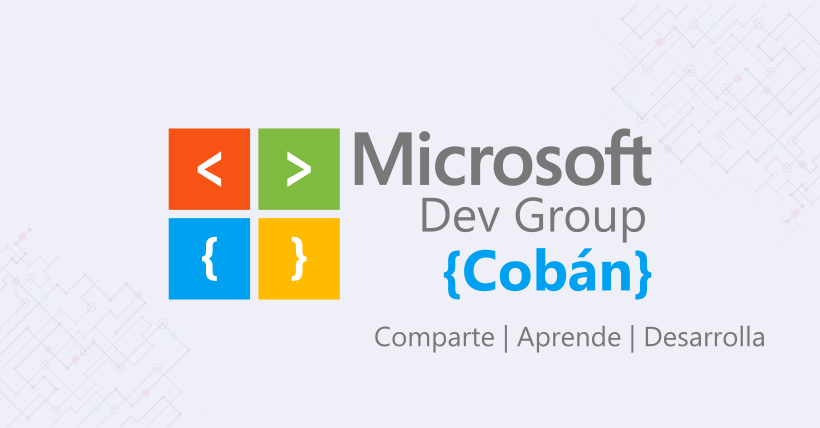

Repositorio de ejemplos de la comunidad de Microsoft Dev Group Cobán. 

Esta comunidad fue fundada para poder compartir y aprender tecnologías en el área de desarrollo de software, DevOps, Bases de Datos, y otras muchas más tecnologías de Microsoft. 

El objetivo es reunir a estudiantes, investigadores y profesionales de la región que trabajan con tecnologías de Microsoft para compartir experiencias y aprendizaje.

## ¿Qué se desea aprender en la comunidad?
* .NET Core
* Microsoft Azure
* SQL Server
* Docker
* Kubernetes
* DevOps

## Síguenos
